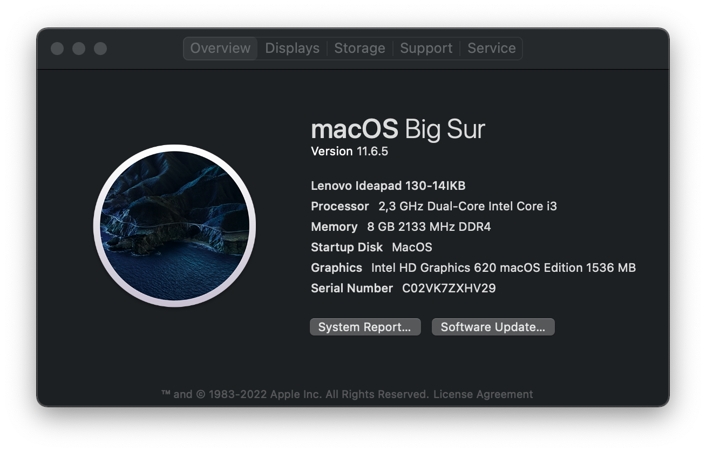

# Hackintosh-Lenovo-Ideapad-130-14IKB-BigSur

## Note 

This is a work in progress, and I am not responsible for any damage to your computer.
## Specs

| Component | Model |
| :---: | :---: |
| OS | Dual Boot (Windows 11 & macOS BigSur 11.6.5 20G527) |
| Bootloader | OpenCore 0.7.9 |
| CPU | Intel Core i3-7020U @ 2.30Ghz |
| GPU | Intel HD Graphics 620 |
| RAM | 4x2GB DDR4 2133MHz (Upgraded) |
| SSD | 240GB V-Gen |
| HDD | 1TB Seagate |
| WiFi & Bluetooth | Intel Dual Band Wireless 7265 (Replaced) |
| Audio | Realtek ALC236 |
| Ethernet | Realtek RTL8111 |
| Touchpad | SYNA2B4C |
## What's Working?

* Intel HD Graphics 620
* Speaker (Buggy in Headphones)
* Microphone (Buggy except in Safari)
* Ethernet (RTL8111)
* WiFi & Bluetooth (Intel Dual Band Wireless 7265)
* All USB Ports
* Battery Indicator
* Sleep
* Brightness Control
* Webcam
* Apple Services (iMessage, iCloud, App Store, etc.)
## What's Not Working?

* HDMI (Not Tested)
* SD Card Reader (Not Tested)
## Bugs

* Speaker (Buggy in Headphones)
* Microphone (Buggy except in Safari)
* Trackpad (Not working after 5 min of usage)
## Credits

* [OpenCore](https://dortania.github.io/OpenCore-Install-Guide/)
